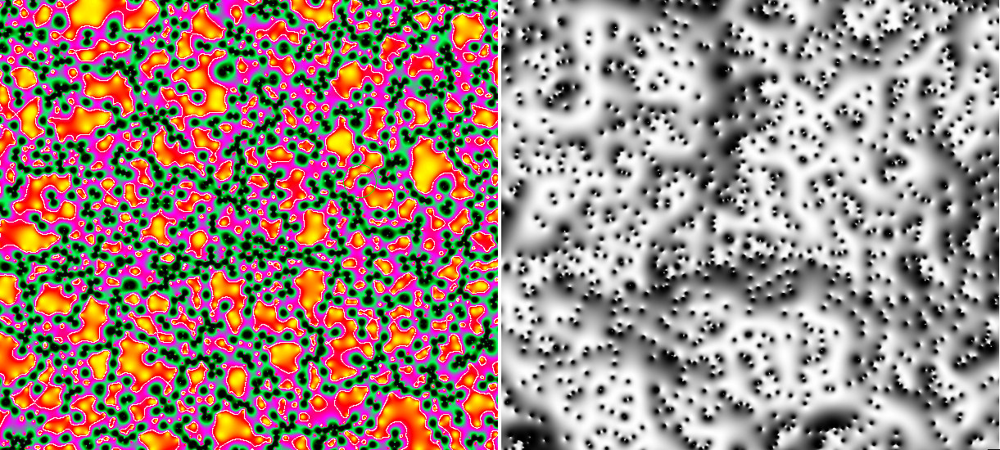

# MicroLensingDemo

*On the left is a map of the inverse magnification.  White contours are the critical curves.  On the right is part of an image of a lensed Gaussian source. The convergence in stars is 1 for both.*

This is a simple program to demonstrate how to do microlensing calculations with GLAMER.

There are more sophisticated things you can do with a `Grid` instead of a `GridMap` as used in this example.  A `Grid` can be dynamically refined near the caustics or around the source images.  But if you have enough memory and enough cores the `GridMap` works just fine.

In your simulation you should make sure:

1) You have set the N_THREADS compiler flag to as many cores as you can 
spare (`cmake .. -DN_THREADS=20` in the build directory of GLAMER for example).  
This code is highly parallelized and will be much faster with more cores.

2) You have made a `GridMap` or `Grid` with a high enough initial resolution to 
resolve all the relavent images.  This usually requires a resolution smaller than the Einstein ring radius of the stars.

3) You don't move the source far enough that the images are no longer on 
the `Grid`.  You can always construct another grid centered on another 
point along the sources path and do it in stages.  If there is a background shear it might be more efficient to have e rectangular `Grid`.

Good luck!  Let me know about what you do with it.
